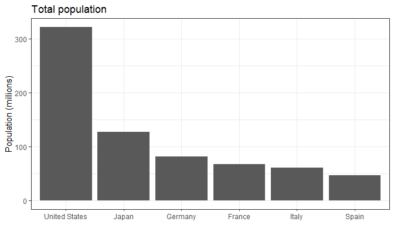

AMECO Dataset
=============

[](https://travis-ci.org/expersso/ameco) [](https://cran.r-project.org/package=ameco) [](https://cran.r-project.org/package=ameco)

This package contains the entire [European Commission Annual macro-economic (AMECO) database](http://ec.europa.eu/economy_finance/db_indicators/ameco/index_en.htm) in a format amenable to analysis in R.

The AMECO database was last updated: 11 May 2017.

Install it from either CRAN or Github:

``` r
# From CRAN
install.packages("ameco")

# From Github
devtools::install_github("expersso/ameco")
```

Simple example
--------------

The dataset is in a clean, long format:

``` r
library(dplyr)
library(ameco)
head(ameco)
```

    ## # A tibble: 6 × 8
    ##                code                           country   sub.chapter
    ##               <chr>                             <chr>         <chr>
    ## 1 EU28.1.0.0.0.NPTD                    European Union 01 Population
    ## 2 EU15.1.0.0.0.NPTD     European Union (15 countries) 01 Population
    ## 3 EA19.1.0.0.0.NPTD                         Euro area 01 Population
    ## 4 EA12.1.0.0.0.NPTD          Euro area (12 countries) 01 Population
    ## 5 DU15.1.0.0.0.NPTD EU15 (including D_W West-Germany) 01 Population
    ## 6 DA12.1.0.0.0.NPTD EA12 (including D_W West-Germany) 01 Population
    ## # ... with 5 more variables: title <chr>, unit <chr>, cntry <chr>,
    ## #   year <dbl>, value <dbl>

Filtering with the `sub.chapter` variable allows you to easily find the variable of interest:

``` r
ameco %>% 
  filter(sub.chapter == "01 Population") %>% 
  .$title %>% 
  unique()
```

    ## [1] "Total population (National accounts)"
    ## [2] "Total population"                    
    ## [3] "Population: 0 to 14 years"           
    ## [4] "Population: 15 to 64 years"          
    ## [5] "Population: 65 years and over"

Being interested in the total population of a few countries, we can easily subset the data and plot the results:

``` r
library(ggplot2)

ameco %>% 
  filter(title == "Total population",
         year == 2015,
         cntry %in% c("USA", "JPN", "DEU", "FRA", "ESP", "ITA")) %>% 
  ggplot(aes(x = reorder(country, -value), y = value / 1000)) +
  geom_bar(stat = "identity") +
  theme_bw() +
  labs(x = NULL, y = "Population (millions)", title = "Total population")
```



Disclaimer
----------

This package is not affiliated with, nor endorsed by, the European Commission. I aim to update it whenever the AMECO database is updated. If you ever see that it is out-of-date, don't hesitate to send a pull request and/or remind me to update it.
